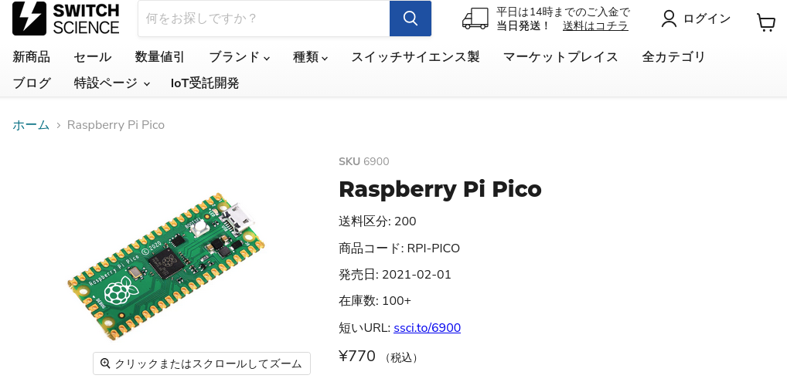

# ⚙ RaspiPicoで自作HIDキーボード作成

- 「raspberry pi pico」で、HIDキーボード作成。※マクロパッドKeybord
- 「promicro」ではなく、「Raspberry pi pico」を使ってみる。

## 前提 
  - HIDキーボード用ファームウェアは、「QMK Firmware & VIA対応」のオープンソースを利用。
  - PCB基盤,ケースまでの作成はしない。手組（ユニバーサル基盤でお手軽作成をする）予定。<br>
  - caseに関しては最終的にアクリル版で対応するところまで作成予定。

## 用意するもの
- Raspberry Pi Pico<br>
    
-【プロトタイプ作成】
    - ブレッドボード<br>
    - タクトスイッチ（ブレッドボード上から動作確認用なくてもよい）
    - ジャンプワイヤー（ブレッドボード用）
-【組み立て】
  - Switch Key<br> 
  - keycap<br>
  - ユニバーサル基盤
  - 半田
  - keyswitch ピッチ変換基盤<br>
   

## 用語説明/参考資料
  - Raspberry pi picoとは
    - Raspberry Pi Picoは、イギリスのRaspberry Pi社が設計した「RP2040」マイクロコントローラーチップを
      搭載した小型で高速、多機能なマイクロコントローラーボード。
    - スペック
      - 2ビットARM Cortex-M0+ デュアルコア、133MHz。
      - 264KB SRAM、2MBフラッシュ。
      - PIO (Programmable I/O) という独自のI/O制御モジュールを持ち、柔軟で高速なハード制御が可能。
  

  - 


  - HIDキーボード
    −
  -
  

## 作業手順
### 1) QMKのコンパイル環境作成
  ```bash🐚
  $ sudo apt update
  $ sudo apt install -y git python3 python3-pip gcc build-essential
  $ python3 -m pip install --user qmk
  $ which qmk
    /home/kd/.local/bin/qmk
  $ qmk setup
  ```
  
- qmkが正常にインストールされたか「qmk doctor」で確認。「QMK is ready to go」確認。
    


### 2) コンパイルしてPICOに書込み
### 3) VIAで確認
### 4) ブレッドボードからユニバーサル基盤へ（実用化するための作業）
### 5) ケース作成


