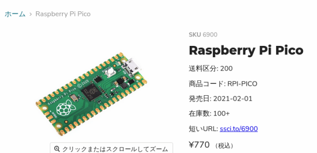
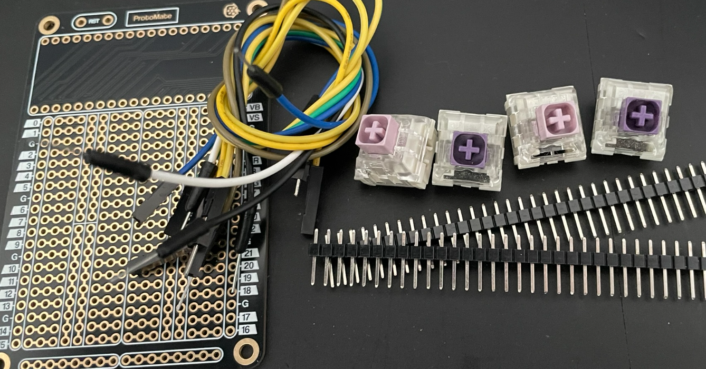
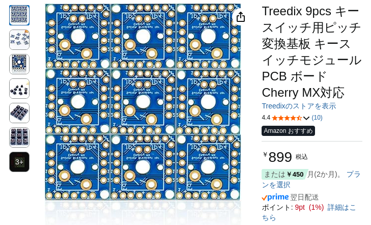
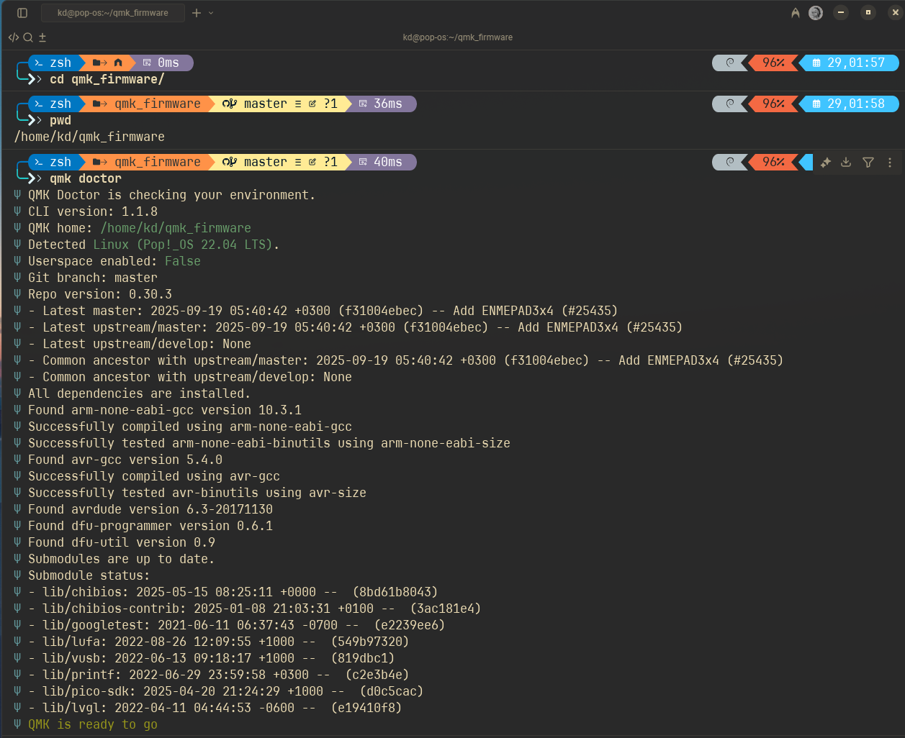
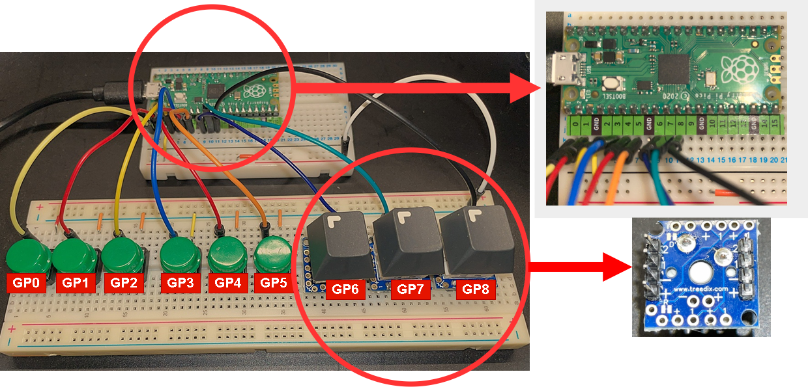

# ⚙ RaspiPicoで簡単自作キーボード作成

- 「raspberry pi pico」で、HIDキーボード作成。※マクロパッドKeybord
- 「promicro」ではなく、「Raspberry pi pico」を使ってみる。

## 前提 
  - HIDキーボード用ファームウェアは、「QMK Firmware & VIA対応」のオープンソースを利用。
  - PCB基盤,ケースまでの作成はしないで手組み。（ユニバーサル基盤で作成予定）<br>
  - 手組みの為PIN直結方式で、且つUSB有線のみ対応とする。（Bluetoothは今後お勉強）
  - ケースに関してはアクリル版で作成し、最低限実運用できる形まで作成予定。（アクリルはレーザカット業者へ依頼）

## 🖥️ 用意するもの
- Raspberry Pi Pico<br>
  
- 【プロトタイプ作成】
    - ブレッドボード<br>
    - タクトスイッチ（ブレッドボード上から動作確認用なくてもよい）
    - ジャンプワイヤー（ブレッドボード用）
- 【組み立て】
  - Switch Key<br> 
  - keycap<br>
  - ユニバーサル基盤
    
  - 半田一式（温調半田ごて、半田、フラックス等々）
  - cherry mx keyswitch ピッチ変換基盤 <br>
   

## 🖥️ 用語説明/参考資料
  - 📌 Raspberry pi picoとは
    - Raspberry Pi Picoは、イギリスのRaspberry Pi社が設計した「RP2040」マイクロコントローラーチップを
      搭載した小型で高速、多機能なマイクロコントローラーボード。
    - スペック
      - 2ビットARM Cortex-M0+ デュアルコア、133MHz。
      - 264KB SRAM、2MBフラッシュ。
      - GPIOのPINは26。
      ※ちなみにArduino「ATmega328P」は、８ビット16MHz,2KB SRAM 32KBフラッシュ、18PIN(Promaicro)
    - 開発環境  
        | 開発言語 | 推奨IDE | 特徴 |
        | :--- | :--- | :--- |
        | **MicroPython / CircuitPython**  | **Thonny (ソニー)** | **Picoで最も推奨されるIDE** 。セットアップが簡単で、初心者向け。MicroPythonのファームウェア書き込みや対話的な実行（REPL）に対応。 |
        | **C / C++ (Pico SDK)** ⚙️ | **Visual Studio Code (VS Code)** | 高度な開発向け。Pico SDKやPlatformIOなどの拡張機能を利用して、高速なC/C++開発を行う。 |
        | **Arduino C++** | **Arduino IDE** | Arduinoユーザー向け。ボードサポートパッケージを追加することで、Arduinoの言語と既存のライブラリを利用可能にする。 |
    
  - 📌 HIDキーボード  
     − Human Interface Device。標準規格に対応したキーボードのこと。現在利用している外付キーボードはほとんどがHIDキーボード。
  

## 作業手順
### 1) QMKのコンパイル環境作成
  ```bash🐚
  $ sudo apt update
  $ sudo apt install -y git python3 python3-pip gcc build-essential
  $ python3 -m pip install --user qmk
  $ which qmk
    /home/kd/.local/bin/qmk
  $ qmk setup
  ```
  
- qmkが正常にインストールされたか「qmk doctor」で確認。「QMK is ready to go」確認。
    

### 2) QMKキーボード作成（keymap作成）
 - 「qmk_firmware/keybord」下に自身の作成するkeybord名（任意）でフォルダ作成。
 - 例）kd/pico_8key 
   ```bash
   $ tree -L 3 keyboards/kd/pico_9key
   keyboards/kd/pico_9key
    ├── config.h
    ├── keyboard.json
    └── keymaps
        └── via
            └── keymap.c
   ```
### 3) コンパイルしてPICOに書込み
 - QMKから認識されているか確認
   ```bash
   $ qmk list-keyboards | grep kd/pico_9key 
     kd/pico_9key
   ```
 - コンパイル　.uf2ファイルが作成された事確認。<br>
   ```bash
     $ qmk compile -kb kd/pico_9key -km via
   
      Ψ Compiling keymap with gmake -r -R -f builddefs/build_keyboard.mk -s KEYBOARD=kd/pico_9key 
      　KEYMAP=via KEYBOARD_FILESAFE=kd_pico_9key TARGET=kd_pico_9key_via VERBOSE=false COLOR=true 
   　　　SILENT=false QMK_BIN="qmk"
      
      arm-none-eabi-gcc (15:10.3-2021.07-4) 10.3.1 20210621 (release)
      Copyright (C) 2020 Free Software Foundation, Inc.
      This is free software; see the source for copying conditions.  There is NO
      warranty; not even for MERCHANTABILITY or FITNESS FOR A PARTICULAR PURPOSE.
      
      Compiling: quantum/via.c                                                                            [OK]
      Linking: .build/kd_pico_9key_via.elf                                                                [OK]
      Creating UF2 file for deployment: .build/kd_pico_9key_via.uf2                                       [OK]
      Copying kd_pico_9key_via.uf2 to qmk_firmware folder                                                 [OK]

     $ ls -al .build
      合計 252
      drwxrwxr-x  4 kd kd   4096  9月 30 11:30 .
      drwxrwxr-x 20 kd kd   4096  9月 28 21:41 ..
      -rwxrwxr-x  1 kd kd 190648  9月 30 11:30 kd_pico_9key_via.elf
      -rw-rw-r--  1 kd kd  82528  9月 30 11:30 kd_pico_9key_via.tmp
      -rw-rw-r--  1 kd kd  58880  9月 30 11:30 kd_pico_9key_via.uf2 ←　※作成されている事
      drwxrwxr-x  4 kd kd   4096  9月 28 21:36 obj_kd_pico_9key_default
      drwxrwxr-x  8 kd kd   4096  9月 28 21:41 obj_kd_pico_9key_via

    $  cp .build/kd_pico_9key_via.uf2 /media/kd/RPI-RP2/. 
    　　//picoは初期時usbメモリーとしてマウントされているので、そのまま.uf2ファイルをコピーする事によって
      　　ブートロードしてくれる。コピー終了した時点で、HIDキーボードとして認識される。
    $ lsusb
      〜省略〜
      Bus 003 Device 033: ID feed:0901 KD kd_pico_9key　←作成したキーボード名として認識されていればOK
   ```

### 4) ブレッドボードでトグルスイッチを使った配線セット
  - 各スイッチ：片側を各GPIO、反対側を共通GNDへ 
  - 直結なので、ダイオード・抵抗は不要 ※QMK側が内部プルアップ
    - keymap.c
      ```
      /*
       * ┌───┬───┬───┐
       * │ q │ w │ e │
       * ├───┼───┼───┤
       * │ a │ s │ d │
       * ├───┼───┼───┤
       * │ z │ x │   │
       * └───┴───┴───┘
       */
      const uint16_t PROGMEM keymaps[][MATRIX_ROWS][MATRIX_COLS] = {
        [_BASE] = LAYOUT(
          KC_Q, KC_W, KC_E,
          KC_A, KC_S, KC_D,
          KC_Z, KC_X, MO(_FN)
        ),
        [_FN] = LAYOUT(
          KC_1, KC_2, KC_3,
          KC_4, KC_5, KC_6,
          KC_7, KC_8, KC_TRNS
        )
      };
      ```
    - keybord.json ※抜粋
      ```
        "direct_pins": [
          ["GP0", "GP1", "GP2"],
          ["GP3", "GP4", "GP5"],
          ["GP6", "GP7", "GP8"]
        ],
      ```
         
  
### 4) VIAで確認

### 5) ブレッドボードからユニバーサル基盤へ（実用化するための作業）
### 6) ケース作成


